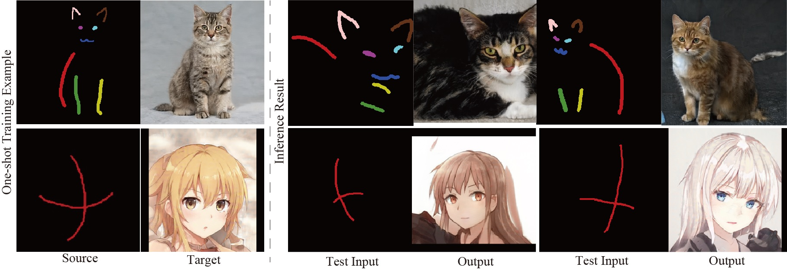
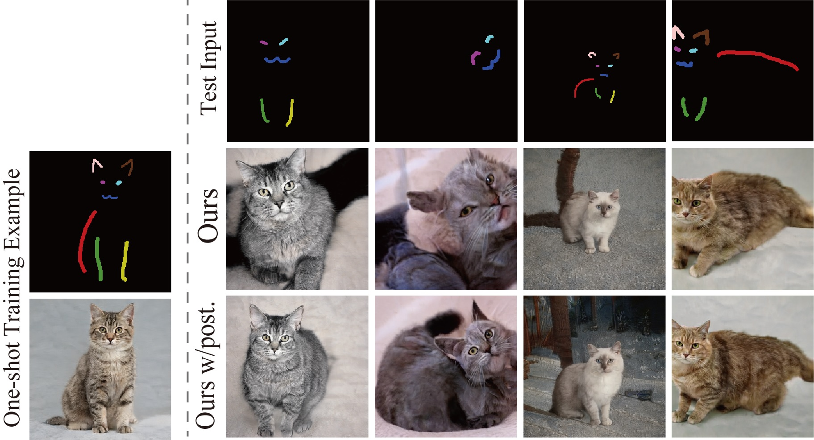

# Controlling StyleGANs Using Rough Scribbles via One-shot Learning
<a href="https://opensource.org/licenses/MIT"></a>

<p align="center">

<br>
Our method can synthesize photorealistic images from rough semantic scribbles using a single training pair and a pre-trained StyleGAN model. 
</p>

This repository contains our implementation of the following paper:

Yuki Endo and Yoshihiro Kanamori: "Controlling StyleGANs Using Rough Scribbles via One-shot Learning," Computer Animation and Virtual Worlds (Computer Graphics International 2022) [<a href="http://www.cgg.cs.tsukuba.ac.jp/~endo/projects/StyleGANSparseControl/">Project</a>][<a href="http://www.cgg.cs.tsukuba.ac.jp/~endo/projects/StyleGANSparseControl/CAVW_endo22_preprint.pdf">PDF (preprint)</a>]

This work is the extended version of <a href="https://github.com/endo-yuki-t/Fewshot-SMIS">our arXiv paper</a> for few-shot semantic image synthesis and contains post-processing refinement for sparse control. 

## Prerequisites  
1. Python3
2. PyTorch

## Preparation
Download <a href="https://drive.google.com/file/d/1s-AS7WRUbL3MzEALxM8y4_XO3n3panxH/view?usp=sharing">StyleGAN pre-trained models</a> or prepare your own StyleGAN models and put them in the "pretrained_models" directory in the parent directoy. 

## Inference with our pre-trained models
1. Download <a href="https://drive.google.com/file/d/1CNxJTxMJqqfBRfKhbPtKZdAyXB1pCfRN/view?usp=sharing">our pretrained encoders</a> and put the "results_sparse" directory in the parent directory. 
2. For example, our results for LSUN cat in a one-shot setting can be generated as follows:
```
python scripts/inference.py --exp_dir=results_sparse/LSUNcat --checkpoint_path=results_sparse/LSUNcat/checkpoints/iteration_100000.pt --data_path=./data/LSUNcat/test/labels/ --couple_outputs --latent_mask=8,9,10,11,12,13
```
Inference results are generated in results_sparse/LSUNcat. If you use other datasets, please specify --exp_dir, --checkpoint_path, and --data_path appropriately. 

3. If you want to refine the results in the post-processing stage, you can use inference_w_post.py instead of inference.py as follows: 
```
python scripts/inference_w_post.py --exp_dir=results_sparse/LSUNcat --checkpoint_path=results_sparse/LSUNcat/checkpoints/iteration_100000.pt --data_path=./data/LSUNcat/test/labels/ --couple_outputs --latent_mask=8,9,10,11,12,13
```

<p align="center">

</p>

## Training
For each dataset, you can train an encoder as follows:
- LSUN cat
```
python scripts/train.py --exp_dir=[result_dir] --dataset_type=lsuncat_scribble_to_img --stylegan_weights pretrained_models/stylegan2-cat-config-f.pt --style_num 14 --start_from_latent_avg --label_nc 9 --input_nc 9 --sparse_labeling
```
- Anime
```
python scripts/train.py --exp_dir=[result_dir] --dataset_type=anime_cross_to_img --stylegan_weights pretrained_models/2020-01-11-skylion-stylegan2-animeportraits-networksnapshot-024664.pt --style_num 16 --start_from_latent_avg --label_nc 2 --input_nc 2 --sparse_labeling
```
- Ukiyo-e
```
python scripts/train.py --exp_dir=[result_dir] --dataset_type=ukiyo-e_scribble_to_img --stylegan_weights pretrained_models/ukiyoe-256-slim-diffAug-002789.pt --style_num 14 --channel_multiplier 1 --start_from_latent_avg --label_nc 8 --input_nc 8 --sparse_labeling
```
- LSUN car
```
python scripts/train.py --exp_dir=[result_dir] --dataset_type=lsuncar_seg_to_img --stylegan_weights pretrained_models/stylegan2-car-config-f.pt --style_num 16 --start_from_latent_avg --label_nc 5 --input_nc 5
```

## Using StyleGAN samples as one-shot training data
1. Run the following script:
```
python scripts/generate_stylegan_samples.py --exp_dir=[result_dir] --stylegan_weights ./pretrained_models/stylegan2-ffhq-config-f.pt --style_num 18 --channel_multiplier 2
```
Then a StyleGAN image (\*.png) and a corresponding latent code (\*.pt) are obtained in [result_dir]/data/images and [result_dir]/checkpoints. 

2. Manually annotate the generated image in [result_dir]/data/images and save the annotated mask in [result_dir]/data/labels. 

3. Edit ./config/data_configs.py and ./config/paths_config.py appropriately to use the annotated pair as a training set. 

4. Run a training command above with appropriate options. 

## Citation
Please cite our paper if you find the code useful:
```
@Article{endoCAVW2022,
Title = {Controlling StyleGANs Using Rough Scribbles via One-shot Learning},
Author = {Yuki Endo and Yoshihiro Kanamori},
Journal = {Computer Animation and Virtual Worlds},
volume = {},
number = {},
pages = {},
doi = {},
Year = {2022}
}
```

## Acknowledgements
This code heavily borrows from the [pixel2style2pixel](https://github.com/eladrich/pixel2style2pixel) repository. 
